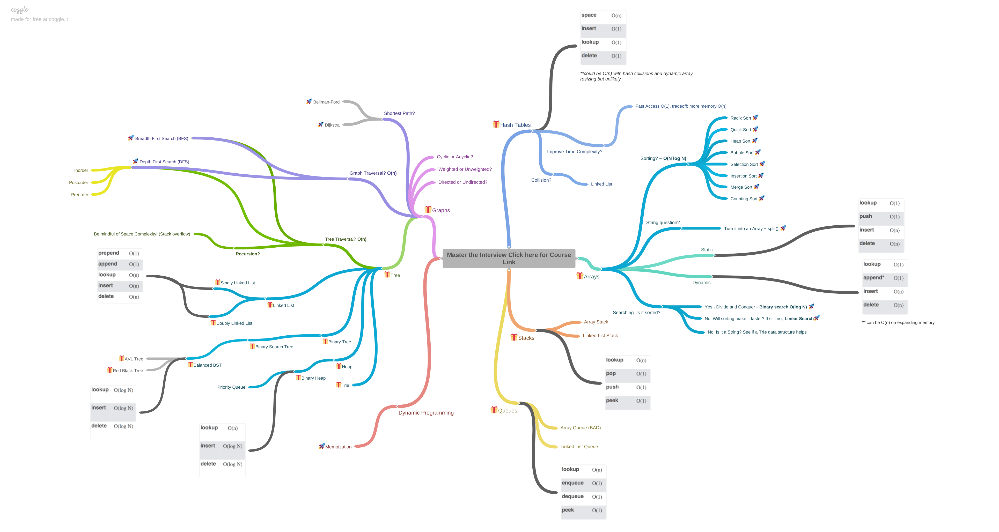

# Introduction

It's not the smartest interviewer that gets hired most of the time. It's the interviewer that is able to answer this fundamental question: **"Will you solve the company's problem?"** -----> How to solve problems?

**Summary** of this section can be found in this [cheatsheet](cheatsheet.pdf). Definitely check out the step by step through a problem. 

# What are companies looking for?

1. Analytic skills: Thought process: from not knowing the answer
2. Coding skills: Do you code well, clean, organized?
3. Technical skills: Do you know the fundamentals, pros and cons of solutions?
4. Communication skills

# What we need to know for coding interview?

In this course, these are covered: the following data structures, algorithms, their Big-O, and a cheatsheet that goes over how to solve a problem step-by-step.
## Data structures:
- Arrays
- Stacks
- Queues
- Linked Lists
- Trees
- Tries
- Graphs
- Hash Tables

## Algorithms:
- Sorting
- Dynamic Programming
- BFS + DFS (searching)
- Recursion

**Diagram of the technical skills:**

Here is the [link](https://coggle.it/diagram/W5E5tqYlrXvFJPsq/t/master-the-interview-click-here-for-course-link) to the diagram of the technical skills shown below.

## Data Structure: Introduction

A data structure is a collection of values. The values can have **relationships among them** and they can have **functions applied to them**. Each one is different in what it can do and what it is best used for. Each data structure is specialized for its own thing.  

A data structure is a way to store data in memory. How a certain data is stored will impact how fast a certain operation can be applied to it.

Resources: 
- YouTube video on [Registers and RAM](https://www.youtube.com/watch?v=fpnE6UAfbtU)
- Data analysis course on [Computer Memory](https://statmath.wu.ac.at/courses/data-analysis/itdtHTML/node55.html)

# Coding interview example from Google:

Here is a [video](https://www.youtube.com/watch?v=XKu_SEDAykw) of a great coding interview example from Google. 

**Problem**: write a code that takes in an ***array*** and a ***value***, the code has to ***return a pair of numbers*** - if exists - from the array that sum to the value. [Here](GoogleInterview.py) is a python script to three different solutions.

