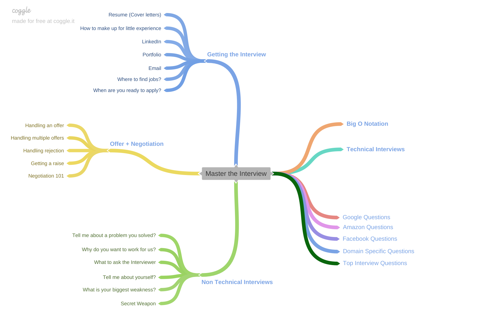

# Master the Coding Interview: Data Structure and Algorithms

This repository contains a summary of the course with some code examples in python. 

The course mind map is shown below and is available in this [link](https://coggle.it/diagram/W5u8QkZs6r4sZM3J/t/master-the-interview).

