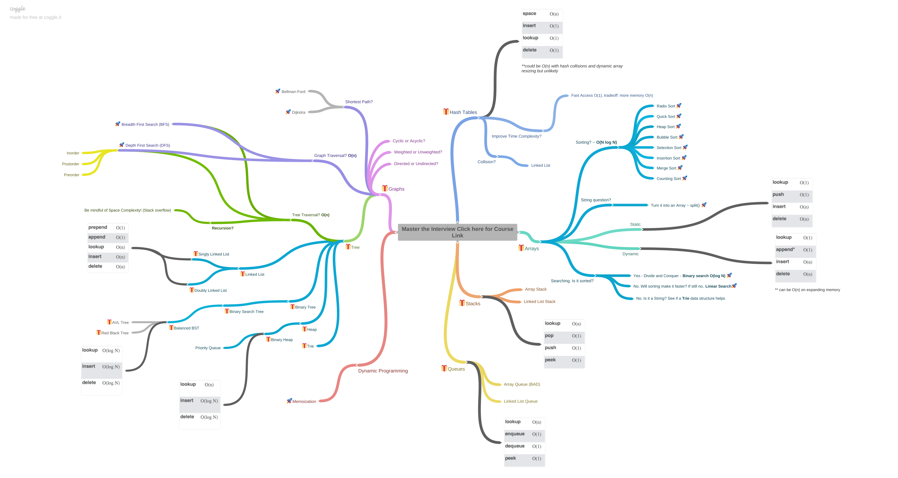

### Introduction

It's not the smartest interviewer that gets hired most of the time. It's the interviewer that is able to answer this fundamental question: **"Will you solve the company's problem?"** -----> How to solve problems?

**Summary** of this section can be found in this [cheatsheet](cheatsheet.pdf). Definitely check out the step by step through a problem. 

### What are companies looking for?

- Analytic skills
	
	Thought process: from not knowing the answer
	
- Coding skills 
	
	Do you code well, clean, organized?
	
- Technical skills
	
	Do you know the fundamentals, pros and cons of solutions?
	
- Communication skills

### What we need to know for coding interview?

In this course, these are covered: the following data structures, algorithms, their Big-O, and a cheatsheet that goes over how to solve a problem step-by-step.
#### Data structures:
- Arrays
- Stacks
- Queues
- Linked Lists
- Trees
- Tries
- Graphs
- Hash Tables

#### Algorithms:
- Sorting
- Dynamic Programming
- BFS + DFS (searching)
- Recursion

**Diagram of the technical skills:**

Here is the [link](https://coggle.it/diagram/W5E5tqYlrXvFJPsq/t/master-the-interview-click-here-for-course-link) to the diagram of the technical skills shown below.

### Coding interview example from Google:

Here is a [video](https://www.youtube.com/watch?v=XKu_SEDAykw) of a great coding interview example from Google. 